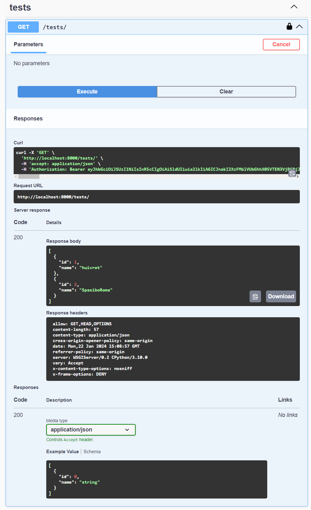

# Система тестирования обчающихся в Дальневосточном центре математики

---
## Stack: 
1. Language: Python 3.10
2. Frameworks
    - Django
    - Djanjo ORM
    - Django REST Framework
    - Django DRF spectacular
3. Platforms
    - Docker
    - Postman
4. Databases
    - PostgreSQL
    - SQLite3
5. SSO: KeyCloack Bearer JWT Auth

---
## Инструкция по запуску
1. Клонировать репозиторий: [https://github.com/theApsil/Testing-system-Django-REST-MVC.git](https://github.com/theApsil/Testing-system-Django-REST-MVC.git)
2. Создайте собственный .venv
3. Настройте интерпретатор
4. `pip install -r requirements.txt`
5. `docker-compose up`

---
## Postman
### Получение токена авторизации
**`POST` запрос по следующему адресу http://localhost:8080/realms/test/protocol/openid-connect/token**

Получение токена следующего формата: eyJhbGciOiJSUzI1NiIsInR5cCIgOiAiSldUIiwia2lkIiA6ICJnakI2XzFMblVUbGhhX05VTEN3VjB6RjJQMXZpVHpEVzlMMlM2eEJVaEprIn0.eyJleHAiOjE3MDU5MzYzMjcsImlhdCI6MTcwNTkzNjAyNywianRpIjoiNGEzYzQ5NzAtMmYzMy00NjgwLTgxYzktZmUwMjU0NzI5MmY4IiwiaXNzIjoiaHR0cDovL2xvY2FsaG9zdDo4MDgwL3JlYWxtcy90ZXN0IiwiYXVkIjoiYWNjb3VudCIsInN1YiI6IjFiOTM0YjY0LTg3MzUtNDIzZS05ODQ3LTVmZjZlNTkwNmJiYyIsInR5cCI6IkJlYXJlciIsImF6cCI6InN0dWRlbnQiLCJzZXNzaW9uX3N0YXRlIjoiNzJiMzBkNzUtYjU4My00MTMxLWI0YWYtN2UzNzE5YzBjODJhIiwiYWNyIjoiMSIsImFsbG93ZWQtb3JpZ2lucyI6WyIvKiJdLCJyZWFsbV9hY2Nlc3MiOnsicm9sZXMiOlsic3R1ZGVudCIsImRlZmF1bHQtcm9sZXMtdGVzdCIsIm9mZmxpbmVfYWNjZXNzIiwidW1hX2F1dGhvcml6YXRpb24iXX0sInJlc291cmNlX2FjY2VzcyI6eyJhY2NvdW50Ijp7InJvbGVzIjpbIm1hbmFnZS1hY2NvdW50IiwibWFuYWdlLWFjY291bnQtbGlua3MiLCJ2aWV3LXByb2ZpbGUiXX19LCJzY29wZSI6InByb2ZpbGUgbWljcm9wcm9maWxlLWp3dCBvcGVuaWQgZW1haWwgdGVzdC1zY29wZSIsInNpZCI6IjcyYjMwZDc1LWI1ODMtNDEzMS1iNGFmLTdlMzcxOWMwYzgyYSIsInVwbiI6ImpvaG4iLCJlbWFpbF92ZXJpZmllZCI6ZmFsc2UsImdyb3VwcyI6WyJzdHVkZW50IiwiZGVmYXVsdC1yb2xlcy10ZXN0Iiwib2ZmbGluZV9hY2Nlc3MiLCJ1bWFfYXV0aG9yaXphdGlvbiJdLCJwcmVmZXJyZWRfdXNlcm5hbWUiOiJqb2huIn0.MdQxzL1LZLqXb3pcO8MbOTKTGciKLw9PlhkbnoxYuZNz_r9BHH1vg4OIMA3qNYoQ-4Fl75gNR_Hutu4IxDfrxh8dEJzR8WE9Dy55EGSeG_ao-PLa6MbyY1wsl-S6FxjeFfA_JgxEBt0qlD49vy08RcPiDcw1HBy1GN0ItCr8w6uZw2oIOXe0kWAfSd77iMumjOvh79DbFvPhMpevjAZfDPcdjkA5LidwU5xy0e8ti4JnxxB4tuHOwcKOt-JU7cQ8d7pigAAlNa3HK2Dzfp2xavwat0Ehx22hnq97bjm8R_OpGGQvbL1QBXK0MDP4u4_5mC9S6QTypnh73vY9MPxjdg
## Swagger 
### 1. **Не авторизованный пользователь**
1.1 Авторизация

1.2 Попытка отправка любого запроса (например `GET /solutions/`)

### 2. **Авторизованный пользователь**
2.1 Общий вид SWAGGER для авторизованного пользователя

2.2 Авторизация

2.3 Результат запроса `GET /solutions/`

2.4 Результат запроса `GET /solutions/{id}`

2.5 Результат запроса `GET /solutions/{id}` для несуществующего solution

2.6 Результат запроса `GET /tests/`

2.7 Результат запроса `GET /tests/{id}`

2.8 Результат запроса `GET /tests/{id}` для несуществующего test

2.9 Результат запроса `POST /tests/{id}/start` если user уже прошёл этот test

2.10 Результат запроса `POST /tests/{id}/start` для несуществующего test

2.11 Результат запроса `POST /tests/{id}/start`

---
## SAST testing

---
### Flake8
До: 

После: 

---
### PyLint
До: 

После: 

---
